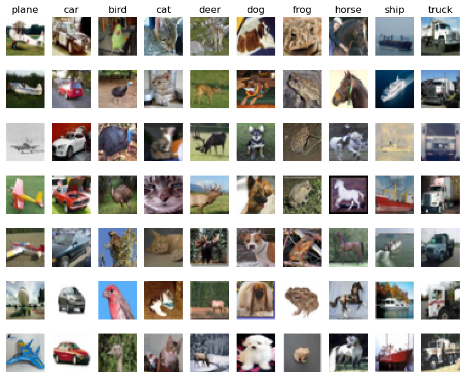
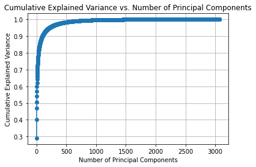

# CIFAR-10 图像分类数据集 (Seen in proj3)

## 数据集分析

### Samples



### PCA 降维



## 支持算法

### Linear SVM

- Linear SVM + HOG: 49.99%
- Linear SVM: 19.10%

### Kernel SVM

- Kernel SVM + HOG: 62.27%
- Kernel SVM: 54.37%

### Gaussian Naive Bayes

- Gaussian Naive Bayes + HOG: 42.34%
- Gaussain Naive Bayes: 29.76%

### ResNet

- Original backbone: 56.36%
- 3x3 convolutions: 86.06%
- Better output: 90.67%
- Shortcut: 94.30%

## 使用方法

为了直观比较各个方法，直接运行 `demo_cnn.ipynb` 和 `demo_ml.ipynb` 来比较深度学习方法和机器学习方法。同时也可以通过命令行输入如下指令来运行程序：

### 深度学习方法

```
python demo_cnn.py --net=3 --is_Train=1 --dataset_path=[YOUR_PATH] --save_dir='./caches/'
```

- `--net={0,1,2,3}`分别代表 1x1 卷积、3x3 卷积、优化输出层以及加入 shortcut 后的网络模型。
- `--is_Train={0, 1}`为是否要重新训练模型。若为否，则自动在`./caches/`中找到提前训练好的模型文件。
- `--dataset_path=[YOUR_PATH]`为数据集的存储路径。
- `--save_dir`：预训练模型储存在`./caches/`中，分别为`net_i.pth`，(i=0,1,2,3)。

### 机器学习方法

```
python demo_ml.py --file_path=[YOUR_PATH]/cifar-10-batches-py --classifier=linear_svm --hog=1 --is_save=1
```

- `--file_path=[YOUR_PATH]/cifar-10-batches-py`为数据集的下一层路径。
- `--classifier={linear_svm, kernel_svm, gaussian_nb}`为本项目所支持的算法。
- `--hog={0, 1}`表示是否要使用 hog 特征预处理。
- `--is_save={0, 1}`为是否要保存训练好的模型（默认保存在`./caches/`中）。
